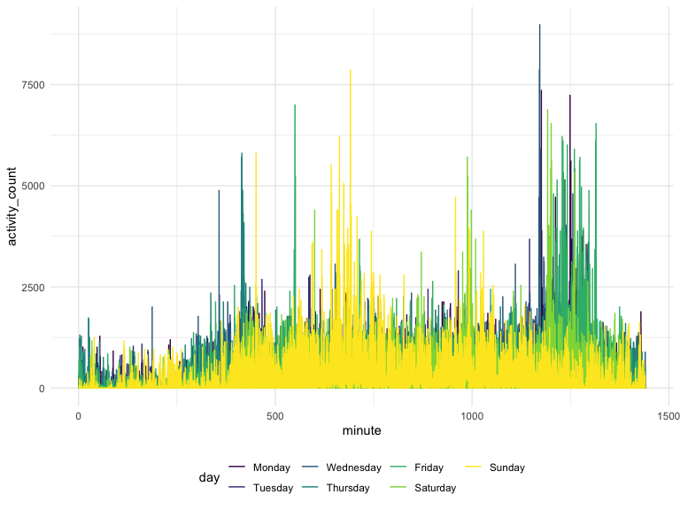

p8105\_hw3\_mp3745
================
Matthew Parker
10/08/2019

# Problem 1

``` r
# Download data
library(p8105.datasets)
data("instacart")

# Clean names
instacart = instacart %>%
  janitor::clean_names()
```

The instacart dataset consists of 1384617 observations of 15 variables.
The data consists of information regarding orders and the items that
were included. In total, there are 131209 orders recorded in the data.

## Distribution of order sizes

``` r
instacart %>% 
  group_by(order_id) %>% 
  summarize(
    order_size = n()
  ) %>% 
  ggplot(aes(x = order_size)) +
  geom_histogram() +
  scale_x_continuous(
    breaks = c(0, 5, 10, 15, 20, 30, 40, 60, 80)
  )
```

    ## `stat_bin()` using `bins = 30`. Pick better value with `binwidth`.


It looks like the vast majority of orders have less than 20 items.

## Orders by day of week

``` r
instacart %>% 
  group_by(order_dow) %>% 
  summarize(
    order_count = n_distinct(order_id)
  ) %>%
  mutate(
    order_dow = recode(
      order_dow, 
      "0" = "Sunday", 
      "1" = "Monday", 
      "2" = "Tuesday", 
      "3" = "Wednesday", 
      "4" = "Thursday", 
      "5" = "Friday",
      "6" = "Saturday"
    )
  ) %>% 
  knitr::kable()
```

| order\_dow | order\_count |
| :--------- | -----------: |
| Sunday     |        27465 |
| Monday     |        19672 |
| Tuesday    |        16119 |
| Wednesday  |        15687 |
| Thursday   |        15959 |
| Friday     |        17406 |
| Saturday   |        18901 |

Unsurprisingly, we can see that most orders from instacart are placed on
Sunday.

## Aisles

``` r
# Top ten aisles by number of items ordered
instacart %>% 
  group_by(aisle) %>% 
  summarize(
    item_count = n()
  ) %>%
  arrange(desc(item_count)) %>% 
  top_n(10) %>%
  knitr::kable(caption = "Top 10 aisles by number of items ordered")
```

    ## Selecting by item_count

| aisle                         | item\_count |
| :---------------------------- | ----------: |
| fresh vegetables              |      150609 |
| fresh fruits                  |      150473 |
| packaged vegetables fruits    |       78493 |
| yogurt                        |       55240 |
| packaged cheese               |       41699 |
| water seltzer sparkling water |       36617 |
| milk                          |       32644 |
| chips pretzels                |       31269 |
| soy lactosefree               |       26240 |
| bread                         |       23635 |

Top 10 aisles by number of items ordered

There are 134 different aisles that items can be ordered from. The fresh
vegetables aisle has the most items ordered from
it.

``` r
# Number of items ordered per aisle (for aisles with over 10,000 items ordered)
instacart %>% 
  group_by(aisle) %>% 
  summarize(
    item_count = n()
  ) %>% 
  filter(item_count > 10000) %>%
  ggplot(aes(x = reorder(aisle, item_count), y = item_count)) + 
  geom_bar(stat = "identity") + 
  coord_flip() + 
  xlab("aisle")
```


This plot shows the number of items ordered per aisle for the aisles
with over 10,000 items ordered. Again, we can see that the fresh
vegetables aisle had the most items ordered.

``` r
# Most popular items for 3 particular aisles
instacart %>% 
  filter(aisle == c("baking ingredients", "dog food care", "packaged vegetables fruits")) %>%
  group_by(aisle, product_name) %>%
  summarize(
    item_count = n()
  ) %>% 
  ungroup() %>%
  group_by(aisle) %>%
  mutate(item_count_ranking = min_rank(desc(item_count))) %>%
  filter(item_count_ranking <= 3) %>% 
  arrange(aisle, item_count_ranking) %>% 
  select(-item_count_ranking) %>% 
  knitr::kable(caption = "Top 3 items ordered from baking ingredients, dog food car, and packaged vegetables fruits aisles")
```

| aisle                      | product\_name                                   | item\_count |
| :------------------------- | :---------------------------------------------- | ----------: |
| baking ingredients         | Light Brown Sugar                               |         157 |
| baking ingredients         | Pure Baking Soda                                |         140 |
| baking ingredients         | Organic Vanilla Extract                         |         122 |
| dog food care              | Organix Grain Free Chicken & Vegetable Dog Food |          14 |
| dog food care              | Organix Chicken & Brown Rice Recipe             |          13 |
| dog food care              | Original Dry Dog                                |           9 |
| packaged vegetables fruits | Organic Baby Spinach                            |        3324 |
| packaged vegetables fruits | Organic Raspberries                             |        1920 |
| packaged vegetables fruits | Organic Blueberries                             |        1692 |

Top 3 items ordered from baking ingredients, dog food car, and packaged
vegetables fruits aisles

From this table, we can see that light brown sugar, organix grain free
chicken & vegetable dog food, and organic baby spinach were the most
popular items from the baking ingredients, dog food care, and packaged
vegetables fruits aisles,
respectively.

``` r
# Mean hour of day that pink lady apples and coffee ice cream are ordered
instacart %>% 
  filter(product_name == c("Pink Lady Apples", "Coffee Ice Cream")) %>%
  group_by(product_name, order_dow) %>% 
  summarize(
    mean_order_hour = round(mean(order_hour_of_day), 0)
  ) %>% 
  mutate(
    order_dow = recode(
      order_dow, 
      "0" = "Sunday", 
      "1" = "Monday", 
      "2" = "Tuesday", 
      "3" = "Wednesday", 
      "4" = "Thursday", 
      "5" = "Friday",
      "6" = "Saturday"
    )
  ) %>% 
  pivot_wider(
    names_from = "order_dow",
    values_from = "mean_order_hour"
  ) %>% 
  knitr::kable(caption = "Mean hour of day that Coffee Ice Cream and Pink Lady Apples are ordered by day of week")
```

| product\_name    | Sunday | Monday | Tuesday | Wednesday | Thursday | Friday | Saturday |
| :--------------- | -----: | -----: | ------: | --------: | -------: | -----: | -------: |
| Coffee Ice Cream |     13 |     15 |      15 |        15 |       15 |     10 |       12 |
| Pink Lady Apples |     12 |     12 |      12 |        14 |       12 |     14 |       12 |

Mean hour of day that Coffee Ice Cream and Pink Lady Apples are ordered
by day of week

From the table we can see that pink lady apples tend to be ordered
earlier in the day compared to coffee ice cream, except for Friday and
Saturday.

# Problem 2

``` r
# Download data
var_names = GET("https://chronicdata.cdc.gov/views/acme-vg9e.json") %>%
  content("text") %>%
  fromJSON() %>% 
  .[["columns"]] %>% 
  .[["name"]] %>% 
  .[-23]

brfss_smart2010 = 
  GET("https://chronicdata.cdc.gov/views/acme-vg9e/rows.json") %>% 
  content("text") %>%
  fromJSON() %>% 
  .[["data"]]

row_as_tibble = function(row_as_list, var_names) {
  var_list = row_as_list[9:32]
  names(var_list) = var_names 
  var_list[sapply(var_list, is.null)] <- NULL
  as_tibble(var_list, validate = FALSE)
}

brfss_smart2010 = 
  brfss_smart2010 %>% 
  map(.x = ., ~row_as_tibble(.x, var_names)) %>% 
  bind_rows
```

``` r
# data cleaning
brfss_smart2010_ovr_hlth = brfss_smart2010 %>% 
  janitor::clean_names() %>% 
  separate(locationdesc, into = c("state", "county"), sep = " - ") %>% 
  select(-locationabbr) %>% 
  filter(topic == "Overall Health") %>% 
  filter(response == c("Excellent", "Very good", "Good", "Fair", "Poor")) %>% 
  mutate(
    response = fct_relevel(as_factor(response), "Poor", "Fair", "Good", "Very good", "Excellent")
  ) %>%
  arrange(response)
```

``` r
# States observed in 2002 at 7 or more locations
brfss_smart2010_ovr_hlth %>% 
  filter(year == 2002)  %>% 
  group_by(state) %>% 
  summarize(
    num_locations = n_distinct(county)
  ) %>% 
  filter(num_locations >= 7) %>% 
  knitr::kable()
```

| state | num\_locations |
| :---- | -------------: |
| CT    |              7 |
| FL    |              7 |
| MA    |              8 |
| NC    |              7 |
| NJ    |              8 |
| PA    |             10 |

There were 6 states observed at 7 or more locations in 2002.

``` r
# States observed in 2010 at 7 or more locations
brfss_smart2010_ovr_hlth %>% 
  filter(year == 2010)  %>% 
  group_by(state) %>% 
  summarize(
    num_locations = n_distinct(county)
  ) %>% 
  filter(num_locations >= 7) %>% 
  knitr::kable()
```

| state | num\_locations |
| :---- | -------------: |
| CA    |             12 |
| CO    |              7 |
| FL    |             41 |
| MA    |              9 |
| MD    |             12 |
| NC    |             12 |
| NE    |             10 |
| NJ    |             19 |
| NY    |              9 |
| OH    |              8 |
| PA    |              7 |
| SC    |              7 |
| TX    |             16 |
| WA    |             10 |

There were 14 states observed at 7 or more locations in 2010, which is
more than 2002.

``` r
# Plot avg_data_value by state over time (year)
brfss_smart2010_ovr_hlth %>% 
  filter(response == "Excellent") %>% 
  group_by(year, state) %>% 
  summarize(
    avg_data_value = mean(as.numeric(data_value), na.rm = TRUE)
  ) %>% 
  select(year, state, avg_data_value) %>% 
  ungroup() %>% 
  ggplot(aes(x = year, y = avg_data_value, group = state, color = state)) + 
  geom_line()
```


From this plot, we can see an overall deceasing trend in the average
data value each year at the state level from 2002 to 2010. For the most
part, the states are fairly clustered together, with some having a
higher average data value than others.

``` r
# Looking at data value in NY by response for 2006 and 2010
brfss_smart2010_ovr_hlth %>% 
  filter(year == c("2006", "2010"), state == "NY") %>%
  mutate(data_value = as.numeric(data_value)) %>% 
  ggplot(aes(x = response, y = data_value, color = response)) +
  geom_violin() +
  facet_grid(~year)
```


The distribution of data value in NY across responses for 2006 and 2010
look relatively similar, however, the distribution for excellent
response has got narrower and decreased in 2010, whereas for fair
response, it has spread apart.

# Problem 3

``` r
# load data
accel_data = read_csv("./data/accel_data.csv") %>% 
  janitor::clean_names() %>% 
  pivot_longer(
    activity_1:activity_1440,
    names_to = "minute",
    names_prefix = "activity_",
    values_to = "activity_count"
  ) %>% 
  mutate(
    minute = as.numeric(minute),
    day = fct_relevel(as_factor(day), "Monday", "Tuesday", "Wednesday", "Thursday", "Friday", "Saturday", "Sunday"),
    is_weekend = if_else(
      day == "Saturday", TRUE, if_else(
        day == "Sunday", TRUE, FALSE
      )
    )
  )
```

    ## Parsed with column specification:
    ## cols(
    ##   .default = col_double(),
    ##   day = col_character()
    ## )

    ## See spec(...) for full column specifications.

In this dataset, we have five weeks of accelerometer data collect on a
63 year-old male with BMI 25. The tidied dataset has the following
variables: week, day\_id, day, minute, activity\_count, is\_weekend.
There are a total of 50400 rows.

``` r
# Total activity by day
accel_data %>% 
  group_by(week, day, is_weekend) %>% 
  summarize(
    tot_daily_activity = sum(activity_count)
  ) %>% 
  select(day, tot_daily_activity, is_weekend) %>% 
  knitr::kable()
```

    ## Adding missing grouping variables: `week`

| week | day       | tot\_daily\_activity | is\_weekend |
| ---: | :-------- | -------------------: | :---------- |
|    1 | Monday    |             78828.07 | FALSE       |
|    1 | Tuesday   |            307094.24 | FALSE       |
|    1 | Wednesday |            340115.01 | FALSE       |
|    1 | Thursday  |            355923.64 | FALSE       |
|    1 | Friday    |            480542.62 | FALSE       |
|    1 | Saturday  |            376254.00 | TRUE        |
|    1 | Sunday    |            631105.00 | TRUE        |
|    2 | Monday    |            295431.00 | FALSE       |
|    2 | Tuesday   |            423245.00 | FALSE       |
|    2 | Wednesday |            440962.00 | FALSE       |
|    2 | Thursday  |            474048.00 | FALSE       |
|    2 | Friday    |            568839.00 | FALSE       |
|    2 | Saturday  |            607175.00 | TRUE        |
|    2 | Sunday    |            422018.00 | TRUE        |
|    3 | Monday    |            685910.00 | FALSE       |
|    3 | Tuesday   |            381507.00 | FALSE       |
|    3 | Wednesday |            468869.00 | FALSE       |
|    3 | Thursday  |            371230.00 | FALSE       |
|    3 | Friday    |            467420.00 | FALSE       |
|    3 | Saturday  |            382928.00 | TRUE        |
|    3 | Sunday    |            467052.00 | TRUE        |
|    4 | Monday    |            409450.00 | FALSE       |
|    4 | Tuesday   |            319568.00 | FALSE       |
|    4 | Wednesday |            434460.00 | FALSE       |
|    4 | Thursday  |            340291.00 | FALSE       |
|    4 | Friday    |            154049.00 | FALSE       |
|    4 | Saturday  |              1440.00 | TRUE        |
|    4 | Sunday    |            260617.00 | TRUE        |
|    5 | Monday    |            389080.00 | FALSE       |
|    5 | Tuesday   |            367824.00 | FALSE       |
|    5 | Wednesday |            445366.00 | FALSE       |
|    5 | Thursday  |            549658.00 | FALSE       |
|    5 | Friday    |            620860.00 | FALSE       |
|    5 | Saturday  |              1440.00 | TRUE        |
|    5 | Sunday    |            138421.00 | TRUE        |

Based on the above table looking at total daily activity, it is hard to
tell if there are any trends. Towards the end of the five week period,
it seems total daily activity tends to be lower around the weekend
though.

``` r
# Activity over the couse of a day by day of week
accel_data %>% 
  ggplot(aes(x = minute, y = activity_count, color = day)) +
  geom_line()
```



From this plot, it seems that this man is more active earlier in the day
on the weekend, especially on Sunday. Conversely, he is more active
later in the day during the week days.
